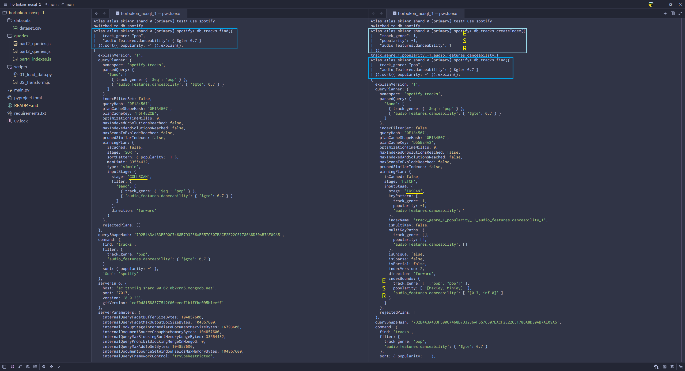

## Завдання 1 — аналітична платформа для музичного стрімінгового сервісу

### Налаштування оточення

Щоб запустити проєкт з нуля, виконайте наступні кроки:

1. Переконайтись що створено нове віртуальне оточення, та встановіть залежності: 
   ```powershell
   pip install -r requirements.txt
   ```

2. Створіть файл `.env` у корені проєкту та додайте рядок підключення до MongoDB:
   ```
   MONGO_URI="mongodb+srv://<user>:<password>@spotify.8b2xrn5.mongodb.net/?appName=Spotify"
   ```

3. Порядок запуску скриптів:
   - Завантажте початкові дані з `datasets/dataset.csv` у колекцію `tracks_raw`:
   ```powershell
   python scripts/01_load_data.py
   ```
   
   - В оточенні Powershell створіть тимчасову змінну з рядком підключення
   ```powershell
   $MONGO_URI="mongodb+srv://...
   ```
   
   - Виконайте трансформацію даних із `tracks_raw` у фінальну колекцію `tracks`:
   ```powershell
   mongosh $MONGO_URI --file scripts/02_transform.js
   ```
  
   - Запустіть скрипти із запитами:
   ```powershell
   mongosh $MONGO_URI --file queries/part2_queries.js
   mongosh $MONGO_URI --file queries/part3_queries.js
   mongosh $MONGO_URI --file queries/part4_indexes.js
   ```

### Частина 1 — Завантаження даних та проєктування схеми

Результат роботи скрипту `02_transform.js`:

```js
Кількість документів у tracks: 113999
Приклад документа:
{
  _id: ObjectId('6a0a0b43db5bdded60edffb4'),
  track_id: '5SuOikwiRyPMVoIQDJUgSV',
  album_name: 'Comedy',
  track_name: 'Comedy',
  popularity: 73,
  duration_ms: 230666,
  explicit: false,
  track_genre: 'acoustic',
  audio_features: {
    danceability: 0.676,
    energy: 0.461,
    loudness: -6.746,
    speechiness: 0.143,
    acousticness: 0.0322,
    instrumentalness: 0.00000101,
    liveness: 0.358,
    valence: 0.715,
    tempo: 87.917,
    key: 1,
    mode: 0,
    time_signature: 4
  },
  duration_sec: 230.7,
  popularity_tier: 'high',
  artists: [
    'Gen Hoshino'
  ]
}
```

#### Теоретичні запитання

> 1. Чому аудіо-характеристики винесені в окремий об’єкт `audio_features`, а не зберігаються плоско? Коли таке вкладення вигідне, а коли створює проблеми?

- так звучить логічніше, коли є певне групування за схожими ознаками
- зручніше управляти всім набором, наприклад, виключати при запиті, де ці дані не треба
- з мінусів: довше писати через крапку фільтри і проекції

> 2. Чому виконавці зберігаються як масив, а не як рядок? Які запити стають простішими?

- можна шукати треки по певному виконавцю, по списку виконавців, по кількості виконавців
- можна зробити агрегацію по виконавцю: кількість треків, найпопулярніший трек, тощо

> 3. Що таке `$out` і чим він відрізняється від `$merge`? Коли використовувати кожен?

- `$out` - для створення нової колекції
- `$merge` - для злиття з існуючою, використовується, якщо треба одночасно оновити існуючі і додати неіснуючі записи

### Частина 2. Запити до даних

Результат роботи скрипту `part2_queries.js`:

```js
Завдання 1. Треки для вечірки:
Знайдено треків: 7311
Декілька прикладів:
[
  {
    _id: ObjectId('6a0a0b43db5bdded60edffc2'),
    track_id: '4LbWtBkN82ZRhz9jqzgrb3',
    album_name: 'Hold On (Remix)',
    track_name: 'Hold On - Remix',
    popularity: 56,
    duration_ms: 188133,
    explicit: false,
    track_genre: 'acoustic',
    audio_features: {
      danceability: 0.755,
      energy: 0.78,
      loudness: -6.084,
      speechiness: 0.0327,
      acousticness: 0.124,
      instrumentalness: 0.0000283,
      liveness: 0.121,
      valence: 0.387,
      tempo: 120.004,
      key: 2,
      mode: 1,
      time_signature: 4
    },
    duration_sec: 188.1,
    popularity_tier: 'medium',
    artists: [
      'Chord Overstreet',
      'Deepend'
    ]
  },
  {
    _id: ObjectId('6a0a0b43db5bdded60ee0000'),
    track_id: '2SkJKMfjpYsNv0KWOxiegX',
    album_name: 'When the Morning Comes',
    track_name: 'Kaleidoscope',
    popularity: 62,
    duration_ms: 229320,
    explicit: false,
    track_genre: 'acoustic',
    audio_features: {
      danceability: 0.709,
      energy: 0.913,
      loudness: -5.148,
      speechiness: 0.0748,
      acousticness: 0.0182,
      instrumentalness: 0,
      liveness: 0.167,
      valence: 0.519,
      tempo: 108.024,
      key: 7,
      mode: 1,
      time_signature: 4
    },
    duration_sec: 229.3,
    popularity_tier: 'medium',
    artists: [
      'A Great Big World'
    ]
  },
  {
    _id: ObjectId('6a0a0b43db5bdded60ee0121'),
    track_id: '3XdStlaHnq3JrmQDCRqEET',
    album_name: 'ショッピング',
    track_name: 'アジアの純真',
    popularity: 32,
    duration_ms: 233280,
    explicit: false,
    track_genre: 'acoustic',
    audio_features: {
      danceability: 0.732,
      energy: 0.83,
      loudness: -6.63,
      speechiness: 0.0309,
      acousticness: 0.201,
      instrumentalness: 0.0000304,
      liveness: 0.0802,
      valence: 0.871,
      tempo: 111.664,
      key: 0,
      mode: 1,
      time_signature: 4
    },
    duration_sec: 233.3,
    popularity_tier: 'low',
    artists: [
      'Yosui Inoue',
      'Tamio Okuda'
    ]
  }
]

Завдання 2. Виконавці, у яких усі треки популярні:
[
  {
    tracks_count: 3,
    min_popularity: 89,
    avg_popularity: 92,
    artist: 'Harry Styles'
  },
  {
    tracks_count: 4,
    min_popularity: 90,
    avg_popularity: 90.5,
    artist: 'Luar La L'
  },
  {
    tracks_count: 5,
    min_popularity: 86,
    avg_popularity: 87.4,
    artist: 'Olivia Rodrigo'
  },
  {
    tracks_count: 4,
    min_popularity: 87,
    avg_popularity: 87,
    artist: 'BYOR'
  },
  {
    tracks_count: 3,
    min_popularity: 79,
    avg_popularity: 84,
    artist: 'IVE'
  },
  {
    tracks_count: 12,
    min_popularity: 76,
    avg_popularity: 83.7,
    artist: 'Måneskin'
  },
  {
    tracks_count: 11,
    min_popularity: 77,
    avg_popularity: 83.5,
    artist: 'Lil Nas X'
  },
  {
    tracks_count: 3,
    min_popularity: 81,
    avg_popularity: 83.3,
    artist: 'Morgan Wallen'
  },
  {
    tracks_count: 5,
    min_popularity: 80,
    avg_popularity: 83,
    artist: 'One Direction'
  },
  {
    tracks_count: 5,
    min_popularity: 80,
    avg_popularity: 82,
    artist: 'TV Girl'
  },
  {
    tracks_count: 4,
    min_popularity: 81,
    avg_popularity: 81.5,
    artist: 'Mac DeMarco'
  },
  {
    tracks_count: 3,
    min_popularity: 81,
    avg_popularity: 81.3,
    artist: 'Cults'
  },
  {
    tracks_count: 4,
    min_popularity: 79,
    avg_popularity: 80.5,
    artist: 'Ricky Montgomery'
  },
  {
    tracks_count: 3,
    min_popularity: 79,
    avg_popularity: 80.3,
    artist: 'Luke Combs'
  },
  {
    tracks_count: 3,
    min_popularity: 80,
    avg_popularity: 80,
    artist: 'Joy Again'
  },
  {
    tracks_count: 3,
    min_popularity: 80,
    avg_popularity: 80,
    artist: 'Declan McKenna'
  },
  {
    tracks_count: 7,
    min_popularity: 69,
    avg_popularity: 79.7,
    artist: 'Mora'
  },
  {
    tracks_count: 3,
    min_popularity: 70,
    avg_popularity: 79.7,
    artist: 'Maroon 5'
  },
  {
    tracks_count: 7,
    min_popularity: 73,
    avg_popularity: 79.4,
    artist: 'Beach Bunny'
  },
  {
    tracks_count: 3,
    min_popularity: 79,
    avg_popularity: 79,
    artist: "Gigi D'Agostino"
  }
]

Завдання 3. Нетипові треки
Знайдено жанрів з нетиповими треками: 112
Приклад (з трьома нетиповими треками):
{
  avg_tempo: 123.92268000000001,
  outlier_threshold: 145.66566440284592,
  genre: 'chicago-house',
  outlier_tracks: [
    {
      _id: ObjectId('6a0a0b43db5bdded60ee32dd'),
      track_name: 'What Does It Feel Like?',
      popularity: 18,
      artists: [
        'Felix Da Housecat'
      ],
      audio_features: {
        tempo: 163.072
      }
    },
    {
      _id: ObjectId('6a0a0b43db5bdded60ee330f'),
      track_name: 'Cool Water - Mixed',
      popularity: 15,
      artists: [
        'Ron Trent',
        'Ivan Conti',
        'Lars Bartkuhn'
      ],
      audio_features: {
        tempo: 170.012
      }
    },
    {
      _id: ObjectId('6a0a0b43db5bdded60ee3354'),
      track_name: 'Urbane Sunset',
      popularity: 13,
      artists: [
        'Mr. Fingers'
      ],
      audio_features: {
        tempo: 194.03
      }
    }
  ]
}

Завдання 4. Треки для фонової роботи
Знайдено треків: 9324
Декілька прикладів:
[
  {
    _id: ObjectId('6a0a0b43db5bdded60edfff2'),
    track_id: '7x4b0UccXSKBWxWmjcrG2T',
    album_name: 'Montage Of Heck: The Home Recordings',
    track_name: 'And I Love Her',
    popularity: 66,
    duration_ms: 124933,
    explicit: false,
    track_genre: 'acoustic',
    audio_features: {
      danceability: 0.616,
      energy: 0.282,
      loudness: -15.317,
      speechiness: 0.0331,
      acousticness: 0.983,
      instrumentalness: 0.833,
      liveness: 0.13,
      valence: 0.435,
      tempo: 96.638,
      key: 1,
      mode: 1,
      time_signature: 4
    },
    duration_sec: 124.9,
    popularity_tier: 'medium',
    artists: [
      'Kurt Cobain'
    ]
  },
  {
    _id: ObjectId('6a0a0b43db5bdded60ee0057'),
    track_id: '5RO0MNa5hBKIM4OcjygadU',
    album_name: 'Chi Mai',
    track_name: 'Chi Mai',
    popularity: 40,
    duration_ms: 188695,
    explicit: false,
    track_genre: 'acoustic',
    audio_features: {
      danceability: 0.739,
      energy: 0.287,
      loudness: -14.007,
      speechiness: 0.059,
      acousticness: 0.969,
      instrumentalness: 0.961,
      liveness: 0.111,
      valence: 0.557,
      tempo: 80.64,
      key: 6,
      mode: 0,
      time_signature: 4
    },
    duration_sec: 188.7,
    popularity_tier: 'medium',
    artists: [
      'Joseph Sullinger'
    ]
  },
  {
    _id: ObjectId('6a0a0b43db5bdded60ee0061'),
    track_id: '7Ca2CkwSqHyr3eCh8IRdjz',
    album_name: 'Mujer con Abanico',
    track_name: 'Mujer con Abanico',
    popularity: 41,
    duration_ms: 156787,
    explicit: false,
    track_genre: 'acoustic',
    audio_features: {
      danceability: 0.769,
      energy: 0.135,
      loudness: -12.049,
      speechiness: 0.061,
      acousticness: 0.986,
      instrumentalness: 0.905,
      liveness: 0.106,
      valence: 0.471,
      tempo: 103.939,
      key: 5,
      mode: 0,
      time_signature: 4
    },
    duration_sec: 156.8,
    popularity_tier: 'medium',
    artists: [
      'Agustín Amigó',
      'Nylonwings'
    ]
  }
]
```

#### Теоретичні запитання

> 1. Для чого використовується інструкція $unwind?

`$unwind` використовується для "розгортання" масиву у документі. Вона бере масив із заданого поля і створює окремий документ для кожного елемента цього масиву. Усі інші поля оригінального документа дублюються в кожному новому документі.

> 2. Чим $stdDevPop відрізняється від $stdDevSamp?

- `$stdDevPop` обчислює стандартне відхилення для генеральної сукупності, використовується, коли дані представляють усю множину.
- `$stdDevSamp` обчислює стандартне відхилення для вибірки, використовується, коли дані є лише частиною більшої множини.

### Частина 3. Аналітика через Aggregation Pipeline

Результат роботи скрипту `part3_queries.js`:

```js
Завдання 1. Топ-10 виконавців за середньою популярністю
[
  {
    artist: 'Olivia Rodrigo',
    avg_popularity: 87.4
  },
  {
    artist: 'Måneskin',
    avg_popularity: 83.7
  },
  {
    artist: 'Lil Nas X',
    avg_popularity: 83.5
  },
  {
    artist: 'One Direction',
    avg_popularity: 83
  },
  {
    artist: 'TV Girl',
    avg_popularity: 82
  },
  {
    artist: 'Bomba Estéreo',
    avg_popularity: 81.5
  },
  {
    artist: 'Mora',
    avg_popularity: 79.7
  },
  {
    artist: 'Beach Bunny',
    avg_popularity: 79.4
  },
  {
    artist: 'Mitski',
    avg_popularity: 78.9
  },
  {
    artist: 'Jhay Cortez',
    avg_popularity: 78.7
  }
]

Завдання 2. Розподіл треків за настроєм
[
  {
    count: 43404,
    mood: 'happy'
  },
  {
    count: 38761,
    mood: 'angry'
  },
  {
    count: 23086,
    mood: 'sad'
  },
  {
    count: 8748,
    mood: 'calm'
  }
]

Завдання 3. Найбільш танцювальний жанр (Top 3)
[
  {
    tracks_count: 1000,
    genre: 'kids',
    avg_danceability: 0.778906,
    avg_energy: 0.6131286,
    avg_valence: 0.6808638
  },
  {
    tracks_count: 1000,
    genre: 'chicago-house',
    avg_danceability: 0.7661760000000001,
    avg_energy: 0.7332150000000001,
    avg_valence: 0.5865412
  },
  {
    tracks_count: 1000,
    genre: 'reggaeton',
    avg_danceability: 0.758521,
    avg_energy: 0.7387279999999999,
    avg_valence: 0.6427535
  }
]
```

#### Теоретичні запитання

> 1. У запиті 1 ми фільтруємо виконавців, у яких менше 5 треків. Як зміниться результат, якщо знизити поріг до 1? А що станеться, якщо вибирати виконавців із більш ніж 50 треками? Поясніть результат.

- Якщо знизити поріг до 1, у топ потраплять виконавці одного хіта
- Якщо підвищити поріг до 50, ми зробимо перекос в сторону більш старих виконавців, які вже встигли написати багато популярних треків.

> 2. У запиті 3 ми фільтруємо жанри з менше ніж 100 треками. Чи зміниться результат, якщо знизити поріг до 50? Поясніть результат.

- Так, результат може змінитися. Зниження порогу до 50 треків збільшує ймовірність статистичної похибки

### Частина 4. Індекси та оптимізація

Результат виконання `part4_indexes.js`:

```js
Завдання 1. Аналіз запиту без індексу
До створення індексу (73 мс, 113999 документів оброблено)
{
  isCached: false,
  stage: 'SORT',
  sortPattern: {
    popularity: -1
  },
  memLimit: 33554432,
  type: 'simple',
  inputStage: {
    stage: 'COLLSCAN',
    filter: {
      '$and': [
        {
          track_genre: {
            '$eq': 'pop'
          }
        },
        {
          'audio_features.danceability': {
            '$gte': 0.7
          }
        }
      ]
    },
    direction: 'forward'
  }
}
Після створення індексу (2 мс, 354 документів оброблено)
{
  isCached: false,
  stage: 'FETCH',
  inputStage: {
    stage: 'IXSCAN',
    keyPattern: {
      track_genre: 1,
      popularity: -1,
      'audio_features.danceability': 1
    },
    indexName: 'track_genre_1_popularity_-1_audio_features.danceability_1',
    isMultiKey: false,
    multiKeyPaths: {
      track_genre: [],
      popularity: [],
      'audio_features.danceability': []
    },
    isUnique: false,
    isSparse: false,
    isPartial: false,
    indexVersion: 2,
    direction: 'forward',
    indexBounds: {
      track_genre: [
        '["pop", "pop"]'
      ],
      popularity: [
        '[MaxKey, MinKey]'
      ],
      'audio_features.danceability': [
        '[0.7, inf.0]'
      ]
    }
  }
}

Завдання 2. Складений індекс для фонової музики
{
  isCached: false,
  stage: 'FETCH',
  inputStage: {
    stage: 'IXSCAN',
    keyPattern: {
      explicit: 1,
      'audio_features.instrumentalness': 1,
      'audio_features.speechiness': 1
    },
    indexName: 'explicit_1_audio_features.instrumentalness_1_audio_features.speechiness_1',
    isMultiKey: false,
    multiKeyPaths: {
      explicit: [],
      'audio_features.instrumentalness': [],
      'audio_features.speechiness': []
    },
    isUnique: false,
    isSparse: false,
    isPartial: false,
    indexVersion: 2,
    direction: 'forward',
    indexBounds: {
      explicit: [
        '[false, false]'
      ],
      'audio_features.instrumentalness': [
        '[0.5, inf.0]'
      ],
      'audio_features.speechiness': [
        '[-inf.0, 0.1]'
      ]
    }
  }
}
```

> 1. Що змінилося в плані виконання?

- Без індексу стадія виконання була `COLLSCAN` (повне сканування колекції), і для сортування використовувався `SORT` (в оперативній пам'яті). 
- Після створення складеного індексу за правилом ESR (`{ track_genre: 1, popularity: -1, "audio_features.danceability": 1 }`) стадія виконання змінилася: замість `COLLSCAN` використовується `IXSCAN` (сканування індексу), а замість сортування в пам'яті порядок документів береться безпосередньо з індексу. Документи витягуються зі стадією `FETCH`. Це суттєво зменшує кількість переглянутих документів та час виконання запиту.



> 2. Як зрозуміти, що індекс використовується? Наведіть скріншот або значення полів із explain(), які це підтверджують.

- В об'єкті, що повертається після `explain`, це підтверджують наступні поля:
  - `queryPlanner.winningPlan.inputStage.stage`: має значення `IXSCAN`
  - `queryPlanner.winningPlan.inputStage.indexName`: містить назву використаного індексу: `explicit_1_audio_features.instrumentalness_1_audio_features.speechiness_1`
  - `executionStats.totalDocsExamined`: це число набагато менше за кількість усіх документів у колекції, оскільки скануються тільки ті документи, які знайдені за допомогою індексу.

> 3. Чи є цей запит покривним (covered query)? 
```
db.tracks.find({ track_genre: "pop", popularity: { $gte: 70 } });
```

- **Ні, запит не є покривним.**
- Щоб запит був покривним, він має задовольняти дві умови: 
  1. Всі поля запиту мають бути в індексі.
  2. Запит має повертати **лише** ті поля, які є в індексі (потрібна проекція).
- У цьому запиті ми не використовуємо проекцію. За замовчуванням MongoDB повертає усі поля, включно з полем `_id`, якого немає в нашому індексі. Тому MongoDB змушена звертатися до самих документів на диску, а не отримувати результати виключно з індексу. Щоб зробити його покривним, потрібно було б додати проекцію: `.find(..., { _id: 0, track_genre: 1, popularity: 1 })`
